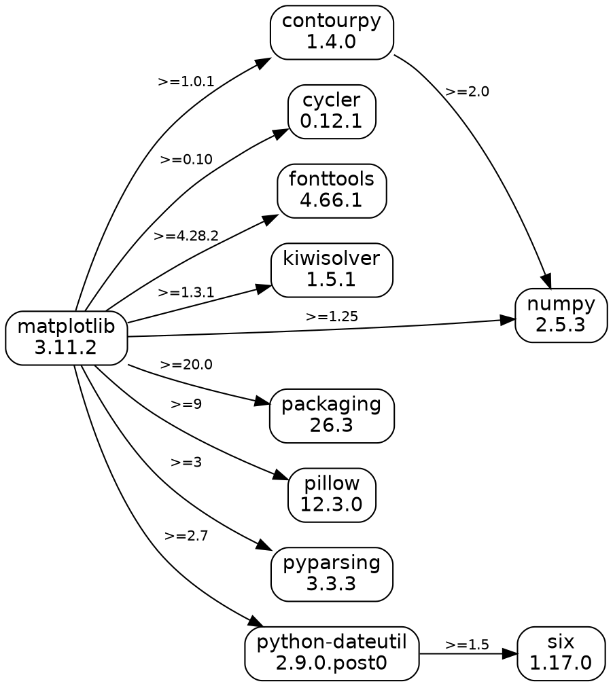

# Отчёт по практическому занятию №2

## Цель работы

Разобраться, что такое менеджер пакетов, как устроен пакет и как читать версии semver; научиться получать служебную информацию о пакетах, строить графы зависимостей и решать задачу о зависимостях пакетов в MiniZinc.

---

## Задача 1

### Решение

```bash
python3 -m venv venv && source venv/bin/activate
pip install matplotlib
pip show matplotlib
ls venv/lib/python3.12/site-packages/matplotlib-3.11.2.dist-info
```

Получение пакета из репозитория без менеджера пакетов:

```bash
git clone https://github.com/matplotlib/matplotlib.git
cd matplotlib
git checkout v3.11.2
```

Код пакета лежит в `lib/matplotlib/`, расширения на C/C++ — в `src/`, метаданные — в `pyproject.toml`. Так как есть расширения, их нужно собрать (meson), добавить результат в `PYTHONPATH` и вручную получить зависимости (`numpy`, `pillow` и др.).

### Результат

```text
Name: matplotlib
Version: 3.11.2
Summary: Python plotting package
Author: John D. Hunter, Michael Droettboom
Author-email: Unknown <matplotlib-users@python.org>
License: License agreement for matplotlib versions 1.3.0 and later [...]
Requires: contourpy, cycler, fonttools, kiwisolver, numpy, packaging, pillow, pyparsing, python-dateutil
Required-by: 
```

```text
INSTALLER  LICENSE  METADATA  RECORD  REQUESTED  WHEEL
```

Основной файл — `METADATA` (в каталоге `*.dist-info`). Его элементы:

- `Name`, `Version`, `Summary`, `Author`, `License` — основные сведения о пакете;
- `Classifier` — стадия разработки, лицензия, поддерживаемые версии Python, тематика;
- `Project-URL` — сайт, документация, исходный код, трекер ошибок;
- `Requires-Python: >=3.11` — допустимые версии интерпретатора;
- `Requires-Dist` — зависимости с ограничениями: `contourpy>=1.0.1`, `cycler>=0.10`, `fonttools>=4.28.2`, `kiwisolver>=1.3.1`, `numpy>=1.25`, `packaging>=20.0`, `pillow>=9`, `pyparsing>=3`, `python-dateutil>=2.7`.

Остальные файлы: `WHEEL` — сведения о сборке, `RECORD` — список файлов с хэшами, `INSTALLER` — чем установлен.

---

## Задача 2

### Решение

```bash
mkdir express-demo && cd express-demo
npm init -y
npm install express
npm view express
cat node_modules/express/package.json
```

Получение пакета из репозитория без менеджера пакетов:

```bash
git clone --depth 1 --branch v5.2.1 https://github.com/expressjs/express.git
cd express
node -e "require('./index.js')"
```

Express — чистый JavaScript, собирать не нужно, но зависимости надо положить в `node_modules` вручную (tarball из `https://registry.npmjs.org/<имя>/-/<имя>-<версия>.tgz` или клон тега репозитория), включая транзитивные — всего 67 пакетов.

### Результат

```text

express@5.2.1 | MIT | deps: 28 | versions: 289
Fast, unopinionated, minimalist web framework
https://expressjs.com/

keywords: express, framework, sinatra, web, http, rest, restful, router, app, api

dist
.tarball: https://registry.npmjs.org/express/-/express-5.2.1.tgz
.shasum: 8f21d15b6d327f92b4794ecf8cb08a72f956ac04
.integrity: sha512-hIS4idWWai69NezIdRt2xFVofaF4j+6INOpJlVOLDO8zXGpUVEVzIYk12UUi2JzjEzWL3IOAxcTubgz9Po0yXw==
.unpackedSize: 75.4 kB

dependencies:
accepts: ^2.0.0
body-parser: ^2.2.1
content-type: ^1.0.5
cookie: ^0.7.1
debug: ^4.4.0
depd: ^2.0.0
encodeurl: ^2.0.0
escape-html: ^1.0.3
etag: ^1.8.1
finalhandler: ^2.1.0
fresh: ^2.0.0
http-errors: ^2.0.0
mime-types: ^3.0.0
on-finished: ^2.4.1
once: ^1.4.0
parseurl: ^1.3.3
proxy-addr: ^2.0.7
qs: ^6.14.0
range-parser: ^1.2.1
router: ^2.2.0
send: ^1.1.0
statuses: ^2.0.1
type-is: ^2.0.1
vary: ^1.1.2
(...and 4 more.)

maintainers:
- wesleytodd <wes@wesleytodd.com>
- jonchurch <npm@jonchurch.com>
- ctcpip <c@labsector.com>
- ulisesgascon <ulisesgascondev@gmail.com>
- sheplu <jean.burellier@gmail.com>

dist-tags:
latest-4: 4.22.3
latest: 5.2.1
```

Запуск без зависимостей:

```text
Error: Cannot find module 'body-parser'
```

После установки зависимостей (`npm install --omit=dev`) минимальное приложение из репозитория работает:

```text
200 Hello from Express built from git!
```

Основные элементы `package.json`:

- `name`, `version` (`5.2.1`), `description`, `author`, `contributors`, `license` (`MIT`), `homepage`, `repository`, `funding`, `keywords` — описание пакета;
- `dependencies` — 28 зависимостей с диапазонами semver, например `router: ^2.2.0`, `qs: ^6.14.0`;
- `devDependencies` — только для разработки (`mocha`, `eslint`, `supertest` и др.);
- `engines` — `node: >= 18`;
- `files` — что попадает в пакет: `LICENSE`, `Readme.md`, `index.js`, `lib/`;
- `scripts` — команды `lint`, `test` и др. Поля `main` нет, точка входа по умолчанию — `index.js`.

---

## Задача 3

### Решение

Зависимости matplotlib взяты из `Requires-Dist` (`importlib.metadata`), зависимости express — из `dependencies` в `package.json` пакетов в `node_modules`:

```bash
python3 gen_pip.py > matplotlib.dot
python3 gen_npm.py > express.dot
dot -Tpng matplotlib.dot -o img/matplotlib.png
dot -Tpng express.dot -o img/express.png
```

### Результат

`matplotlib.dot`:




`express.dot` (124 ребра) — в файле `express.dot`:


---

## Задача 4

### Решение

Билет из шести цифр, счастливый, если сумма первых трёх равна сумме последних трёх. Все цифры различны. Минимизируется сумма трёх цифр, затем номер билета.

```minizinc
include "alldifferent.mzn";

% Шестизначный билет d1 d2 d3 d4 d5 d6 (ведущие нули разрешены).
array[1..6] of var 0..9: d;

% s - сумма трёх цифр (одинаковая для левой и правой половин билета)
var 0..27: s;

% номер билета как число
var 0..999999: number = sum(i in 1..6)(d[i] * pow(10, 6 - i));

% счастливый билет: сумма первых трёх цифр равна сумме последних трёх
constraint d[1] + d[2] + d[3] = s;
constraint d[4] + d[5] + d[6] = s;

% дополнительное ограничение: все цифры билета различны
constraint all_different(d);

% минимальная сумма s, а при равенстве - минимальный номер билета
solve minimize s * 1000000 + number;

output [
  "Билет: ", concat([show(d[i]) | i in 1..6]), "\n",
  "Сумма трёх цифр: ", show(s), "\n"
];
```

### Результат

```text
Билет: 026134
Сумма трёх цифр: 8
----------
==========
```

---

## Задача 5

### Решение

Версии кодируются как `major*10000 + minor*100 + patch`. По рисунку: `root` → `menu ^1.0.0`, `icons ^1.0.0`; `menu 1.0.0` → `dropdown ^1.0.0`; `menu 1.1.0…1.5.0` → `dropdown ^2.0.0`; `dropdown 2.x` → `icons ^2.0.0`; `dropdown 1.8.0` и `icons` без зависимостей.

```minizinc
% Версии кодируются числом major*10000 + minor*100 + patch,
% 0 означает "пакет не устанавливается".
% Диапазон ^1.0.0 = [10000, 20000), ^2.0.0 = [20000, 30000).

set of int: MENU     = {10000, 10100, 10200, 10300, 10400, 10500};
set of int: DROPDOWN = {10800, 20000, 20100, 20200, 20300};
set of int: ICONS    = {10000, 20000};

var MENU:     menu;
var DROPDOWN: dropdown;
var ICONS:    icons;

% root -> menu ^1.0.0 (любая из версий 1.x), root -> icons ^1.0.0
constraint menu  >= 10000 /\ menu  < 20000;
constraint icons >= 10000 /\ icons < 20000;

% menu 1.0.0 -> dropdown ^1.0.0
constraint menu = 10000 -> (dropdown >= 10000 /\ dropdown < 20000);

% menu 1.1.0 ... 1.5.0 -> dropdown ^2.0.0
constraint menu >= 10100 -> (dropdown >= 20000 /\ dropdown < 30000);

% dropdown 2.0.0 ... 2.3.0 -> icons ^2.0.0 ; dropdown 1.8.0 зависимостей не имеет
constraint dropdown >= 20000 -> (icons >= 20000 /\ icons < 30000);

% предпочитаем самые новые версии
solve maximize menu + dropdown + icons;

output [
  "root 1.0.0\n",
  "menu     ", show(menu div 10000), ".", show((menu mod 10000) div 100), ".", show(menu mod 100), "\n",
  "dropdown ", show(dropdown div 10000), ".", show((dropdown mod 10000) div 100), ".", show(dropdown mod 100), "\n",
  "icons    ", show(icons div 10000), ".", show((icons mod 10000) div 100), ".", show(icons mod 100), "\n"
];
```

### Результат

```text
root 1.0.0
menu     1.0.0
dropdown 1.8.0
icons    1.0.0
----------
==========
```

Новые `menu` тянут `dropdown 2.x` и `icons 2.x`, что конфликтует с `icons ^1.0.0` из `root`.

---

## Задача 6

### Решение

```minizinc
% Версии: major*10000 + minor*100 + patch; 0 - пакет не устанавливается.
% ^1.0.0 = [10000,20000), ^2.0.0 = [20000,30000)

var {0, 10000, 10100}: foo;      % foo 1.0.0, 1.1.0
var {0, 10000}:        left;     % left 1.0.0
var {0, 10000}:        right;    % right 1.0.0
var {0, 10000, 20000}: shared;   % shared 1.0.0, 2.0.0
var {0, 10000, 20000}: target;   % target 1.0.0, 2.0.0

% root 1.0.0 -> foo ^1.0.0, target ^2.0.0
constraint foo    >= 10000 /\ foo    < 20000;
constraint target >= 20000 /\ target < 30000;

% foo 1.1.0 -> left ^1.0.0, right ^1.0.0
constraint foo = 10100 -> (left  >= 10000 /\ left  < 20000);
constraint foo = 10100 -> (right >= 10000 /\ right < 20000);

% left 1.0.0 -> shared >=1.0.0
constraint left = 10000 -> shared >= 10000;

% right 1.0.0 -> shared <2.0.0 (и пакет должен быть установлен)
constraint right = 10000 -> (shared >= 10000 /\ shared < 20000);

% shared 1.0.0 -> target ^1.0.0
constraint shared = 10000 -> (target >= 10000 /\ target < 20000);

% пакет не ставим, если он никому не нужен
constraint (left  != 0) <-> (foo = 10100);
constraint (right != 0) <-> (foo = 10100);
constraint (shared != 0) <-> (left != 0 \/ right != 0);

solve maximize foo + left + right + shared + target;

function string: ver(int: v) =
  if v = 0 then "не устанавливается"
  else show(v div 10000) ++ "." ++ show((v mod 10000) div 100) ++ "." ++ show(v mod 100) endif;

output [
  "root   1.0.0\n",
  "foo    ", ver(fix(foo)),    "\n",
  "left   ", ver(fix(left)),   "\n",
  "right  ", ver(fix(right)),  "\n",
  "shared ", ver(fix(shared)), "\n",
  "target ", ver(fix(target)), "\n"
];
```

### Результат

```text
root   1.0.0
foo    1.0.0
left   не устанавливается
right  не устанавливается
shared не устанавливается
target 2.0.0
----------
==========
```

`root` требует `target 2.0.0`, а `shared 1.0.0` (нужен `right`, а значит `foo 1.1.0`) требует `target ^1.0.0` — конфликт, поэтому `foo 1.0.0`.

---

## Задача 7

### Решение

Общая модель `task7.mzn`, конкретная задача задаётся только данными (`.dzn`). Диапазоны semver записываются парой `[lo, hi)`.

```minizinc
% Общая модель разрешения зависимостей пакетов.
% Версия кодируется числом major*10000 + minor*100 + patch, 0 = "не установлен".
% Пакет №1 - корневой (root), он всегда устанавливается.

int: nP;                                  % число пакетов
array[1..nP] of string: pname;            % имена пакетов
array[1..nP] of set of int: avail;        % доступные версии каждого пакета

int: nD;                                  % число зависимостей
array[1..nD] of 1..nP: dep_from;          % кто зависит
array[1..nD] of int:   dep_fver;          % от какой версии зависящего пакета
array[1..nD] of 1..nP: dep_to;            % от какого пакета
array[1..nD] of int:   dep_lo;            % допустимые версии: dep_lo <= v < dep_hi
array[1..nD] of int:   dep_hi;

% выбранная версия каждого пакета
array[1..nP] of var int: x;
constraint forall(p in 1..nP)(x[p] in avail[p] union {0});

% корень устанавливается обязательно
constraint x[1] != 0;

% если выбрана версия dep_fver пакета dep_from, то зависимость должна выполняться
constraint forall(d in 1..nD)(
  x[dep_from[d]] = dep_fver[d] ->
    (x[dep_to[d]] >= max(1, dep_lo[d]) /\ x[dep_to[d]] < dep_hi[d])
);

% пакет устанавливается только если он кому-то нужен
constraint forall(p in 2..nP)(
  x[p] != 0 -> exists(d in 1..nD)(dep_to[d] = p /\ x[dep_from[d]] = dep_fver[d])
);

% среди допустимых решений выбираем те, где версии новее
solve maximize sum(p in 1..nP, v in avail[p])(bool2int(v <= x[p]));

function string: ver(int: v) =
  if v = 0 then "-"
  else show(v div 10000) ++ "." ++ show((v mod 10000) div 100) ++ "." ++ show(v mod 100) endif;

output [ pname[p] ++ " " ++ ver(fix(x[p])) ++ "\n" | p in 1..nP ];
```

Данные для задачи 5 (`data5.dzn`) и задачи 6 (`data6.dzn`) лежат в одноимённых файлах:

```bash
minizinc task7.mzn data5.dzn
minizinc task7.mzn data6.dzn
```

### Результат

```text
root 1.0.0
menu 1.0.0
dropdown 1.8.0
icons 1.0.0
----------
==========
```

```text
root 1.0.0
foo 1.0.0
left -
right -
shared -
target 2.0.0
----------
==========
```

Результаты совпадают с задачами 5 и 6.
